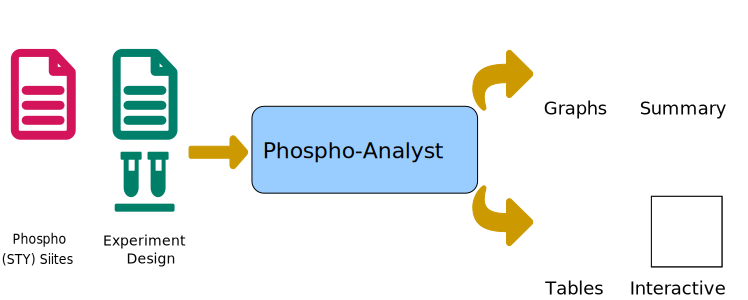

[](https://www.repostatus.org/#active)


# Phospho-Analyst
A tool for analysing label-free quantitative proteomics dataset on both peptide and protein level https://phosphoanalyst.erc.monash.edu/




## Motivation

- Automate downstream statistical analysis of Label free quantitative proteomics data on both peptide and protein level (generated by MaxQuant)


### Input

- MaxQuant **Phospho (STY)Sites.txt** file
- A phosphosite experiment design table (tab separated file) containing three columns ("label", "condition", "replicate")
- (Optional) MaxQuant **proteinGroups.txt** file
- (Optional) A protein experiment design table (tab separated file) containing three columns ("label", "condition", "replicate")

#### Data pre-filtering criteria

-Remove reverse sequences 
-Remove potential contaminants 
-Remove localization probability  < 0.75
-Expand Phosphosite intensity columns from wide to long format
-Extract peptide sequences information
-Remove observations with high proportion of missing values

#### Advanced parameters to choose

- Differencial expression cutoff
  - Adjusted p-value cutoff (FDR cutoff on quantitation)
  - Log2 fold change cutoff
- Option to choose paired test for matched pair data
- Types of imputation
  - A number of missing value imputation options including knn, Minpob etc.
- Type of FDR correction
  -   Benjamin Hochberg (BH) method
  -   t-statistics correction: Implemented in
    [fdrtools](http://strimmerlab.org/software/fdrtool/)
- Option to include phosphosites/proteins identified/quantified with a single unique peptide.
- Select how many clusters of differentially expressed phosphosites/proteins needed for the heatmap (default is 6)


### Outputs

#### Result table

-   **Results Table:** Includes names (Phosphosite/Gene names), Phosphosite/Protein Ids, 
    Adjusted *ANOVA p-values*,  *ANOVA p-values*,Log
    fold changes/ ratios (each pairwise comparisons), Adjusted
    *p-values* (applying FDR corrections), *p-values*, Boolean values
    for significance, average protein intensity (log transformed) in
    each sample.

#### Result Plots
  1. Interactive volcano plot for each pairwise comparison.
  2. Heatmap of differencially expressed phosphosites/proteins
  3. Phosphosite intensity plots for a single or group of selected phosphosites/proteins from table. 

#### QC Plots
  1. PCA plot (Could move to QC section)
  2. Sample Correlation (pearson correlation)
  3. Sample Coefficient of variations (CVs)
  4. Number of phosphosites/proteins per sample
  5. Sample coverage (overlap of identified phosphosites/proteins across every sample)
  6. Missing value heatmap
  7. Imputation effect on sample distribution

### Download options

**Download tables** (csv format)

1.  Results: Same as *Results Table*
2.  Unimputed data matrix: Original phosphosite/protein intensities before
    imputation in each sample.
3.  Imputed data matrix: Phosphosite/Protein intensities after performing selected
    imputation method
4.  Full results: Combined table of all above data outputs i.e. with and
    without imputation information, along with fold change and p-values.

**Download Report** 
- A summary report for each analysis that
    includes method, summary statistics and plots.


### Local installation

The current version of Phospho-Analyst is hosted on `R - 4.1.0`. The detailed dependency information can be found in the `dependencies.txt` file.

Once installed all the dependencies following steps to run the server locally.

- Using git and Rstudio
```
## Clone the repository
git clone https://github.com/MonashProteomics/MaxQuant-phosphoproteomics-analysis.git

## Move to the folder
cd Phospho-Analyst

## Inside R console or R studio
> library("shiny")

> runApp()

```

- Using Docker

Install & start Docker demon on your PC

```
## Clone the repository
git clone https://github.com/MonashProteomics/Phospho-Analyst.git

## Move to the folder
cd Phospho-Analyst

## Build Phospho-Analyst (Any name after -t)
> docker build -f Dockerfile -t Phospho-Analyst .

## Run Phospho-Analyst (From terminal)

> docker run -p 3838:3838 Phospho-Analyst

## Open local interface

https://localhost:3838/LFQ-Analyst


```


If you are using more recent versions of R i.e `R  3.6.0`, please clone the **dev** branch. 

```
# cloning single branch
git clone https://github.com/MonashBioinformaticsPlatform/LFQ-Analyst.git -b dev --single-branch /your_folder/location/
```
